# BLLED Controller — v3

An ESP32 controller that drives a 12 V RGB + warm/cold-white LED strip so its colour tells you what
your **Bambu Lab** printer (X1 / X1C / X1E / P1P / P1S / A1) is doing — printing, paused, finished,
filament run-out, printer alerts — by listening to the printer's local MQTT feed. v3 is a ground-up
rework of the original firmware: same hardware, same wiring, same default colours, new engine,
new web interface, a REST/WebSocket API and Home Assistant integration.

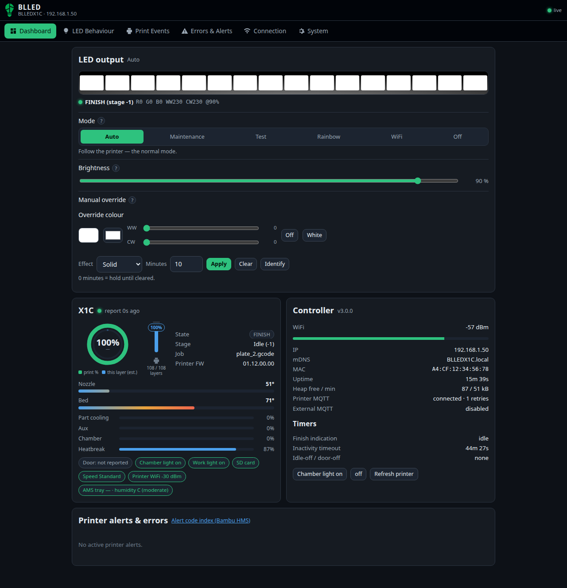

## Contents

- [What it does](#what-it-does)
- [Hardware](#hardware)
- [Quick start (first install)](#quick-start-first-install)
- [A tour of the web interface](#a-tour-of-the-web-interface)
- [Upgrading from v2](#upgrading-from-v2)
- [Home Assistant](#home-assistant)
- [Troubleshooting](#troubleshooting)
- [Technical reference](#technical-reference)
- [Building from source](#building-from-source)
- [License and credits](#license-and-credits)

## What it does

- **Follows the printer.** The strip is white while idle/printing, dims (or goes dark) during
  Micro-Lidar stages so it doesn't blind the sensor, turns blue on pause, red on serious/fatal printer
  alerts (Bambu's *HMS* — Health Management System — messages), filament run-out, a dropped front cover or a heater fault, and green when a print finishes.
  Every colour is configurable, with separate RGB and warm/cold-white channels.
- **State visualisations.** Optional effects: a *progress blend* that shifts the running colour
  toward the finish colour as the print advances, a *temperature glow* while preheating, and
  breathe / blink / fast-blink for errors, pauses and the finish indication.
- **Follows the chamber light** (and can control it): turn the printer's light off in Bambu Studio
  or the app and the strip follows; open the door and it lights up; close the door twice quickly to
  toggle the strip by hand.
- **Finish & inactivity handling.** Stay green until you open the door (or for N minutes), then go
  back to white, then off after the inactivity timeout.
- **Web interface** that works on a phone: live dashboard (what the printer is doing, what the LEDs
  are doing and *why*), every setting explained with a tooltip, WiFi and printer discovery, OTA
  updates, backup/restore, live log.
- **API + Home Assistant.** Everything on the dashboard is available as JSON over REST and
  WebSocket, and optionally published to your own MQTT broker with Home Assistant auto-discovery
  (a light entity you can drive from automations, plus printer sensors).

## Hardware

The board is a plain ESP32 (`esp32dev`) switching five 12 V channels through MOSFETs. It drives
common-anode **RGB + CCT (warm/cold white) analog strips** — not addressable (WS2812) strips.

| Channel | GPIO | Notes |
|---|---|---|
| Red | 19 | 5 kHz PWM, 8-bit |
| Green | 18 | |
| Blue | 21 | |
| Warm white | 22 | |
| Cold white | 23 | |

Power the board from a **12 V** supply sized for your strip (24 V will misbehave). The default
brightness after a fresh install is 20 % so an under-sized supply doesn't sag; raise it in the UI.
Ready-made BLLED boards and wiring diagrams are at [dutchdevelop.com/blled](https://www.dutchdevelop.com/blled).

## Quick start (first install)

You need: the board, a USB cable, your printer's **IP address**, **serial number** and **LAN access
code** (printer screen → Settings → Network / General). The printer must be in **LAN mode** or have
**Developer mode / LAN-only MQTT** enabled on newer firmware.

### 1. Flash the firmware (once, over USB)

Pick one:

- **Browser (easiest):** open <https://esp.huhn.me> (or any ESP Web Tools page) in Chrome or Edge,
  connect the board over USB, choose `firmware/esp32dev/BLLC_V3.0.0.bin` from this repository and
  flash it at address **0x0**.
- **Command line:**
  ```
  pip install esptool
  esptool.py --chip esp32 --port /dev/ttyUSB0 --baud 921600 write_flash 0x0 firmware/esp32dev/BLLC_V3.0.0.bin
  ```

The `.bin` is a complete image (bootloader + partition table + app), which is why it is flashed at
offset 0. Later updates go over the air from the web UI.

### 2. Connect to the setup network

After flashing, the strip cycles **white → red → orange** and, because no WiFi is configured yet,
settles on **pink** and opens an access point called **`BLLED_AP`** (no password).

Join `BLLED_AP` from your phone or laptop. Your device detects the captive portal and shows a
**"Sign in to network"** prompt — tap it and the setup page opens. If the prompt doesn't appear,
open `http://192.168.4.1` in a browser.

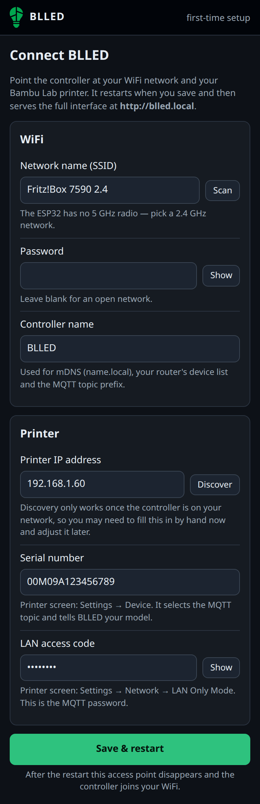

### 3. Fill in the setup page

1. **WiFi** — pick your network from the scan list and enter the password. Optionally give the
   controller a name (it becomes `http://<name>.local`).
2. **Printer** — press *Discover* to find printers on your LAN (the printer has to be on the same
   network as the one you're joining), or type the IP by hand. Enter the serial number and access
   code.
3. **Save.** The controller restarts, joins your WiFi (strip goes orange → blue → cyan) and starts
   following the printer. Open `http://blled.local` (or the IP shown on your router).

That's it. The defaults reproduce the classic BLLED behaviour; everything below is optional.

## A tour of the web interface

The interface is one page with six sections — tabs on a desktop, a bottom bar on a phone. Every
setting has a **?** with a plain-language explanation; the same texts are collected in
[docs/manual.md](docs/manual.md).

### Dashboard

Live view: what the strip shows right now (and the *reason*, e.g. "Printing (stage 0)" or "Printer
alert: serious"), a quick mode switch (Auto / Maintenance / Test / Rainbow / WiFi / Off), the brightness
slider, a manual override colour with a timer, and an *Identify* button that blinks the strip so you
know which controller you're talking to. Below: the printer card (state, stage, progress, layer,
time left, temperatures with targets, fans, door/lid (the printer reports one enclosure state for both), chamber light, AMS, active printer alerts (HMS messages) with
links to the Bambu wiki and a one-click *ignore*), the controller card (WiFi signal, IP, uptime,
memory, MQTT links) and the finish/inactivity timers.

<p>
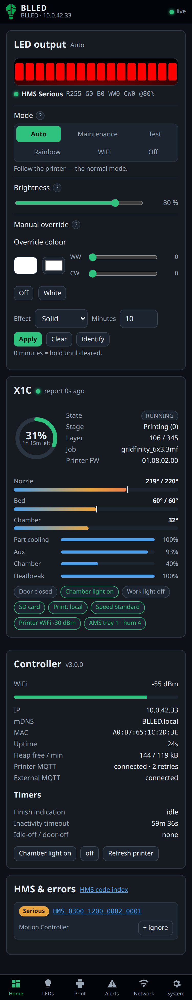
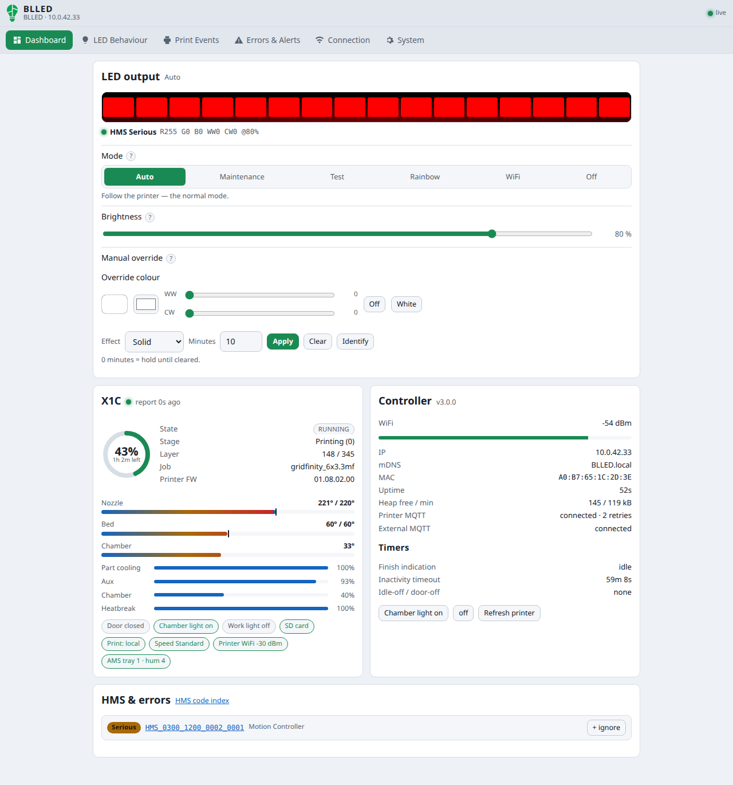
</p>

### LED Behaviour

Mode, brightness, fade time, effect speed, "follow the printer's chamber light", the running /
maintenance / test / boot colours, and the *while printing* and *while preheating* visualisations.

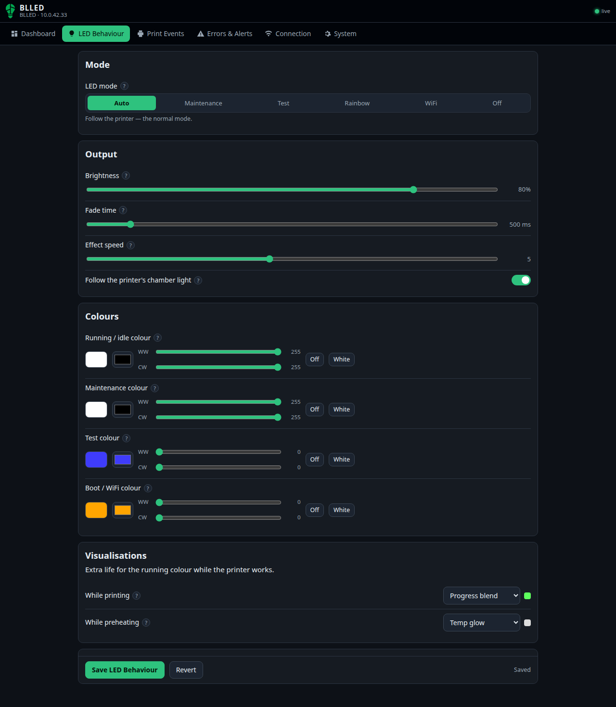

### Print Events

Finish indication (colour, effect, end by door or by timer), inactivity timeout, chamber-light
control, the door double-close gesture, the P1 switch (no lidar, no door sensor) and the colours
used during the lidar stages (bed levelling, nozzle cleaning, extrusion calibration, bed scan,
first-layer inspection).

<p>
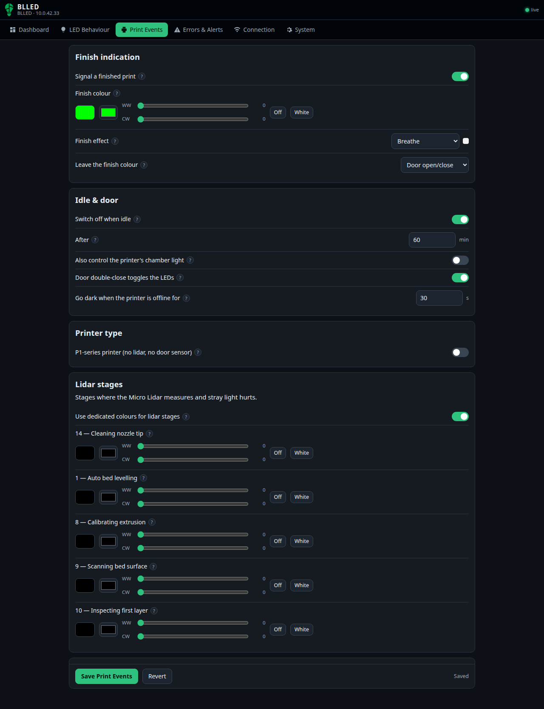
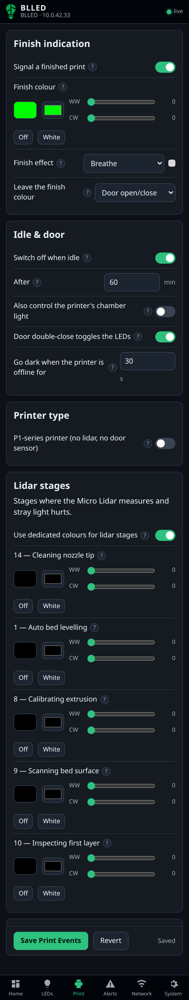
</p>

### Errors & Alerts

The error-detection master switch, error/pause effects, colours for pause, first-layer error,
nozzle clog, printer alerts (fatal / serious / optionally common), filament run-out, front cover, nozzle and bed
heater faults, and the alert-code ignore list (e.g. to silence a "dirty lidar" advisory).

<p>
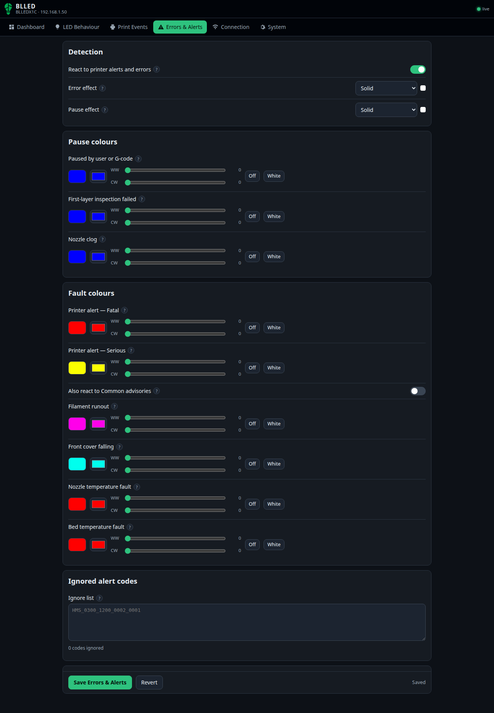
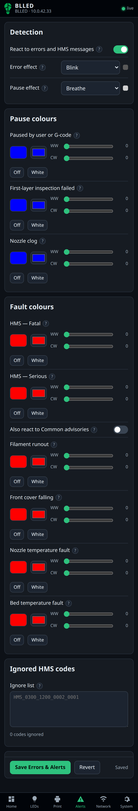
</p>

### Connection

WiFi (scan, pin the strongest access point, controller name), printer (IP with discovery, serial,
access code), web-UI username/password, and the external MQTT broker / Home Assistant settings.
Changing a network setting shows a *restart required* banner with a button.

<p>
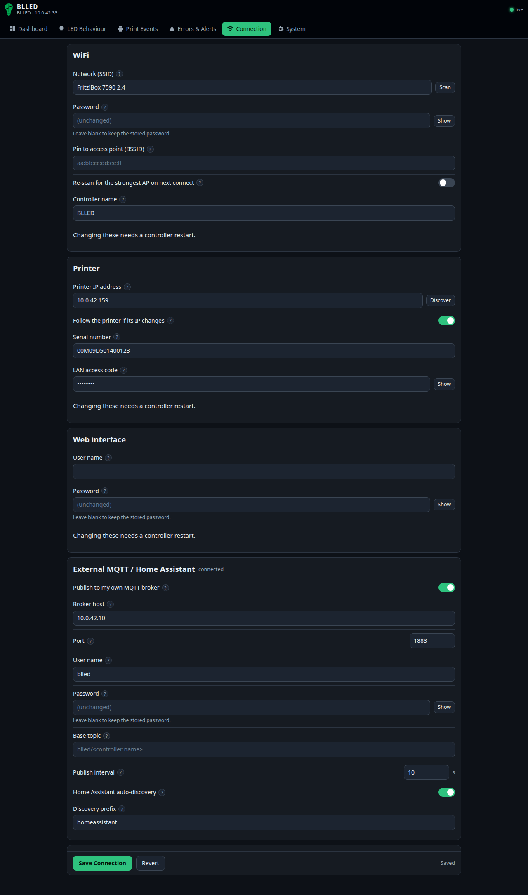
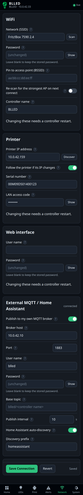
</p>

### System

Firmware version and build info, **OTA update** (upload a `.bin.ota`), **backup / restore** of the
configuration as JSON, factory reset, restart, debug logging switches and the live log console.

<p>
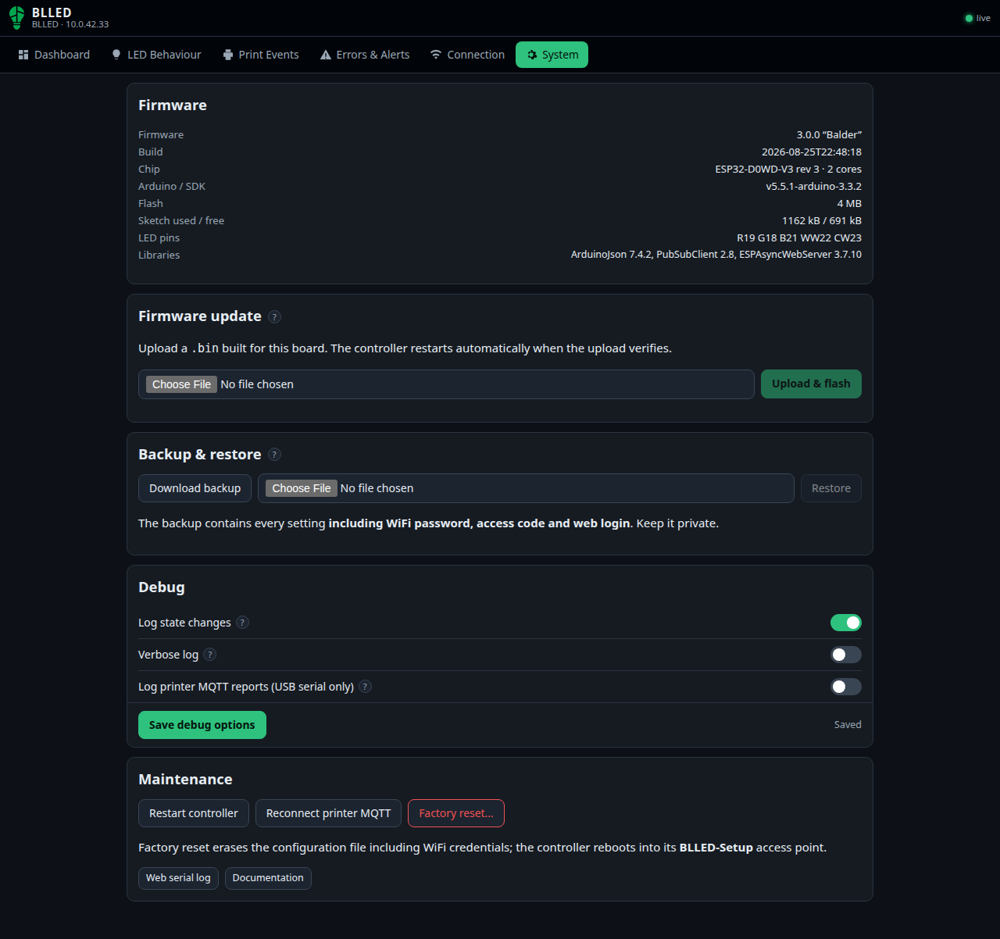
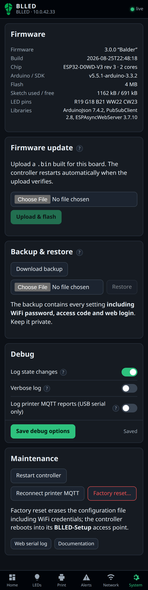
</p>

## Upgrading from v2

- **The first v3 install needs a USB flash** (step 1 above). v3 uses a larger application partition
  than the v2 firmware; the v2 OTA page will refuse the image. Later v3 updates are OTA.
- **Back up first** (v2: *Backup & Restore → Download*). The v3 firmware reads a v2 configuration
  file and migrates it automatically (the five old mode checkboxes become one *LED mode*, timers in
  milliseconds become minutes, `replicatestate` becomes *follow chamber light*, and so on — the
  full key map is in [docs/CHANGELOG.md](docs/CHANGELOG.md)). If you restore a v2 backup into v3 the
  same migration runs.
- Behaviour changes worth knowing: the strip no longer freezes on an old error after a print is
  cancelled; brightness 0 % really is off; the door double-close toggle stays off until the next
  door interaction or the next print instead of any MQTT message waking it.
- Removed: the old form endpoints (`/submitConfig`, `/submitWiFi`), the GET factory reset and the
  `/config.json` route that returned the WiFi password in plain text. `/getConfig`,
  `/configfile.json`, `/printerList`, `/update` and `/configrestore` still work as aliases.

## Home Assistant

Connection → *External MQTT*: enable it, enter your broker's host/port/user/password and leave
*Home Assistant discovery* on. The controller announces itself as a device with:

- a **light** (turning it on applies a manual override colour, off returns the strip to automatic),
- a **select** for the LED mode and a **number** for brightness,
- **sensors**: stage, G-code state, progress, remaining time, layer / total layers, nozzle / bed /
  chamber temperature, LED reason, printer alert level, WiFi signal,
- **binary sensors**: printer connected, door open, chamber light, finish indication active,
- **buttons**: identify, refresh printer state, restart.

Without discovery you can still use the topics directly (`blled/<name>/status`, `/led`, `/set`,
`/cmd`, `/light`, `/light/set`) — see [docs/API.md](docs/API.md).

## Troubleshooting

**Boot colours** tell you where start-up got to: all channels on → **red** (file system) →
**orange** (connecting to WiFi) → **blue** (web server up) → **cyan** (connecting to the printer) →
normal operation. **Pink** means the controller is in setup-AP mode.

| Symptom | What to check |
|---|---|
| Strip stays **pink** | No WiFi credentials, wrong password, or the network wasn't reachable at boot. Join `BLLED_AP` and re-enter the WiFi details. If credentials are stored, the controller keeps retrying in the background and restarts by itself when the network comes back. |
| Strip **off** after ~30 s, dashboard says *Printer offline* | The printer's MQTT isn't reachable: wrong IP/access code, printer asleep, or the printer firmware requires LAN/Developer mode for third-party MQTT. The controller re-discovers a printer that changed IP automatically (same serial). |
| Dashboard shows **connected** but nothing changes | Press *Refresh printer* on the dashboard (sends a `pushall`). P1/A1 printers only send changes; v3 asks for a full state on connect, but a printer firmware update can need a nudge. |
| A **red** strip you don't want | Open the printer-alert list on the dashboard: *ignore* the code, or switch off *Also react to Common advisories*. |
| Can't reach `blled.local` | Some networks block mDNS; use the IP from your router or the one shown in the setup page. |
| Forgot the web-UI password | Connect over USB, open a serial terminal at 115200 baud and send the line `{"resetAuth":true}` — the controller clears the username/password and restarts. (Factory reset on the System page needs the password.) |

The **live log** (System → *Log console*, or `http://<ip>/webserial`) shows every state change with
the reason for each LED decision; the *Debug* switches make it more verbose.

## Technical reference

- [docs/ARCHITECTURE.md](docs/ARCHITECTURE.md) — the design: module ownership, the threading model
  (main loop owns the LEDs, one FreeRTOS task owns both MQTT clients, the web server only sets
  flags), the LED priority ladder, config persistence and migration, and the JSON contracts.
- [docs/API.md](docs/API.md) — every REST endpoint with `curl` examples, the WebSocket message,
  MQTT topics and payloads, and the Home Assistant entity list.
- [docs/REVIEW.md](docs/REVIEW.md) — the code review of the v2 firmware that motivated the rework
  (44 findings: concurrency, blocking, logic, security).
- [docs/HA-DISCOVERY.md](docs/HA-DISCOVERY.md) — the Home Assistant discovery reference used for
  the implementation.
- [docs/UI.md](docs/UI.md) — how the web interface is built and how to run it against the mock server.
- [docs/CHANGELOG.md](docs/CHANGELOG.md) — every behaviour change and the v2 → v3 key map.

### How it works, in one paragraph

A FreeRTOS task keeps a TLS MQTT session to the printer (`device/<serial>/report`, port 8883,
user `bblp`, password = access code), requests a `pushall` on connect and parses each report
through an ArduinoJson filter into a `printerState` struct guarded by a mutex. The main loop
snapshots that struct, runs a first-match priority ladder (override → mode → errors → pause →
offline → chamber light → lidar stages → inactivity → finish → preheat → printing → idle) to
produce a target colour, effect and human-readable *reason*, and a non-blocking engine fades the
five PWM channels toward it, applies the effect and the global brightness, and writes hardware only
on change. The web server serves gzipped assets from flash, exposes the same status model over
REST and a 1 Hz WebSocket, and the optional external MQTT publisher runs inside the MQTT task.

### The captive portal

In AP mode a wildcard DNS server answers every name with `192.168.4.1`, and the web server answers
the connectivity-probe URLs that operating systems fetch after joining a network
(`/generate_204` on Android, `/hotspot-detect.html` on iOS/macOS, `/connecttest.txt` and
`/ncsi.txt` on Windows, `/canonical.html` and `/success.txt` on Firefox) with a redirect to the
setup page, which is what makes the "sign in to network" prompt appear. Any other unknown URL
redirects there too. The setup page is fully self-contained (no sub-resources) because captive
mini-browsers are picky, and it is served without authentication only while the AP is up. HTTPS
probes can't be intercepted, so a browser that only tries `https://` sites needs the address typed
in.

### Repository layout

```
src/main.cpp              setup()/loop()
src/blled/types.h         shared structs, enums, globals, lock macros (the contract between modules)
src/blled/stages.h        stage / gcode-state / alert (HMS) name tables
src/blled/leds.h          LED engine + priority ladder
src/blled/filesystem.h    config load/save/migrate/validate (table-driven, flat JSON)
src/blled/mqttmanager.h   printer MQTT task, report parser, command queue
src/blled/mqttpublish.h   external broker + Home Assistant discovery
src/blled/api.h           /api/* handlers and the status/config JSON builders
src/blled/web-server.h    routes, auth, static assets, WebSocket, captive portal
src/blled/wifi-manager.h  connect ladder, reconnect back-off, async scan, AP mode
src/blled/bblPrinterDiscovery.h  non-blocking SSDP printer discovery
src/www/                  index.html + app.js + style.css (SPA), wifiSetup.html (portal)
tools/mock_server.py      stdlib mock of the whole API for UI development
tools/test_api.sh         curl smoke test against a real controller
tools/capture_printer_mqtt.py / fixtures_x1c_pushall.json   real X1C report for parser work
docs/                     see above
firmware/                 release images and ESP Web Tools manifests
```

## Building from source

Requirements: [PlatformIO Core](https://platformio.org/) (CLI or the VS Code extension), Python 3.
The platform is pinned to [pioarduino](https://github.com/pioarduino/platform-espressif32)
(Arduino core 3.3.x); the official `platformio/espressif32` platform is frozen at core 2.x and
won't build v3.

```
git clone https://github.com/pwsh/BLLEDController -b v3-rework
cd BLLEDController
pio run                       # -> .firmware/BLLC_V3.0.0.bin (full image) and .bin.ota (OTA)
pio run -t upload             # flash over USB
pio device monitor            # 115200 baud
```

`pre_build.py` gzips everything in `src/www/` into `src/www/www.h` before each build; keep the
compressed total under ~60 kB. `merge_firmware.py` produces the merged image.

Working on the UI without hardware:

```
python3 tools/mock_server.py          # http://localhost:8080 serves src/www with simulated data
```

Testing the API against a real controller:

```
tools/test_api.sh 10.0.42.33          # optional: BLLED_USER/BLLED_PASS for HTTP auth
```

Provisioning over USB (handy on a bench): send one JSON line at 115200 baud —
`{"wifiSSID":"…","wifiPass":"…","printerIP":"…","accessCode":"…","serialNumber":"…"}` — the
controller saves it and restarts.

## License and credits

Creative Commons Attribution-NonCommercial-ShareAlike 4.0 (CC BY-NC-SA 4.0) — see [LICENSE](LICENSE).

- **[DutchDeveloper](https://dutchdevelop.com/)** — original author and hardware
- **[softwarecrash](https://github.com/softwarecrash)** — v2 maintenance, MQTT rework, flasher site
- **Modbot**, **xps3riments**, **longrackslabs** — testing, inspiration, build process
- The Bambu protocol knowledge comes from the community: [OpenBambuAPI](https://github.com/Doridian/OpenBambuAPI)
  and [ha-bambulab](https://github.com/greghesp/ha-bambulab).
