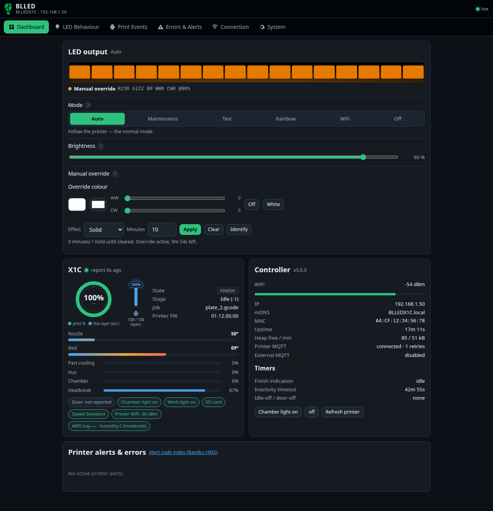

# Dashboard
{: .no_toc }

The dashboard answers two questions: *what is the printer doing?* and *why is the strip that
colour?*

  
On this page

  {: .text-delta }
- TOC
{:toc}

It is live. A WebSocket pushes a fresh status about once a second, and the page falls back to
polling if the socket cannot be opened. The indicator next to the BLLED logo reads **live**,
**polling**, **reconnecting** or **no data**.

---

## LED output, and the reason

The preview strip at the top is painted with the colour the hardware is actually emitting — the RGB
channels composited with the warm- and cold-white ones, animated with the same breathe, blink and
rainbow curves the firmware uses. Underneath are the exact channel values and the **reason** the
engine picked this colour:

> *Printing (stage 0)* · *Chamber light off* · *Printer alert: serious* · *Manual override* ·
> *Toggled off via door* · *Printer offline*

The LED engine works down a fixed priority ladder and the first matching rule wins. The reason line
names that rule, which makes it the fastest way to understand a colour you did not expect. The
ladder itself is listed in [LED effects & visualisations](../guides/led-effects.md#the-priority-ladder).

## The live controls

These three apply the moment you touch them and are not part of any Save button.

**Mode** switches between the same six modes as the LED Behaviour tab — Auto, Maintenance, Test,
Rainbow, WiFi and Off — and takes effect straight away.

**Brightness** moves the strip as you drag it.

**Manual override** forces any colour onto the strip regardless of what the printer is doing. Pick
the colour, set a number of minutes, and it releases itself when the timer runs out; set **0** and
it holds until you press **Clear**. It is the quick way to try a colour before committing to it,
or to use BLLED as a plain lamp for an evening.

**Identify** blinks the strip white three times. If you have more than one controller, this is how
you work out which one the browser tab is pointing at.

## The printer card

### The rings

Two concentric rings sit at the top of the printer card.

- The **thick outer ring** is the print percentage, exactly as the printer reports it.
- The **thin inner ring** is the *estimated* progress **within the current layer**. The printer
  does not report this — BLLED times how long recent layers took and measures how long the current
  one has been running. It is empty on the first layer, because there is nothing to average yet.

The percentage and the remaining time sit in the middle, and a small `print % / this layer (est.)`
legend sits underneath.

How the estimate behaves, and when it lies, is covered in
[Layer progress](../guides/layer-progress.md).

### The layer gauge

Beside the rings, a **vertical gauge** runs from a printer glyph at the bottom (first layer) to a
marker at the top (last layer). The knob rides up as the print grows and carries the layer
percentage; the caption underneath gives the exact `layer / total layers`.

When the printer is idle, or has not sent a layer count, both the inner ring and the gauge sit at
zero and the caption reads *no layer data*.

### State, temperatures and fans

Below that: the G-code state and the stage name, the job name, the nozzle, bed and chamber
temperatures with their target markers, and the four fan speeds (part, aux, chamber, heatbreak).

### The chips

A row of small chips reports things that are either on or off:

| Chip | Notes |
|---|---|
| **Door** | Reads *Door: not reported* and stays muted until the printer has actually reported a door change. See below. |
| **Chamber light** | The printer's own light. |
| **Work light** | |
| **SD card** | |
| **Print type** and **Speed level** | |
| **Printer WiFi** | The printer's signal, not the controller's. |
| **AMS** | The active tray and its humidity. |

**About the door chip.** The printer has exactly **one** door switch, at the front door edge. The
**top lid has no sensor at all**. If your door does not press that switch when it closes, the
printer never reports a door change and the chip stays on *Door: not reported* — and BLLED notices:
the finish indication falls back to its timer automatically instead of waiting forever for a door
event that will never arrive. See [Door sensor](../guides/door-sensor.md).

**About AMS humidity.** The chip shows Bambu's **A to E** level, where **A is driest**. The printer
actually sends an index from 1 to 5 in which **5 means dry**, and that raw number is what the API
returns — the interface converts it for you.

## Printer alerts & errors

Every alert the printer is currently reporting, worst first, with a severity badge and a link to
the Bambu wiki page for that code.

"Alert" here means an **HMS** message — Bambu's **Health Management System**, the diagnostics that
also raise the codes on the printer's own screen and in Bambu Studio. The interface says "printer
alert" because that is what it is; the code format `HMS_0300_1200_0002_0001` is the same one Bambu
uses everywhere else.

The **+ ignore** button next to a message adds its code to the ignore list and saves immediately.
That is the quick way to silence a nuisance code that keeps turning your strip red — a known AMS
quirk, or a sensor you have already decided to live with. The list itself is on the
[Errors & Alerts](errors-alerts.md#ignored-alert-codes) tab.

## The controller card

WiFi signal, IP address and mDNS name, uptime, free heap, the state of both MQTT connections (the
printer's and, if you enabled it, your own broker) and the MAC address.

## The timers

Two countdowns, when they are running:

- **Finish indication** — how much longer the finish colour stays on, when it is set to end on a
  timer.
- **Inactivity** — how long until the LEDs switch themselves off. It restarts on any change from
  the printer and on every door open or close, so it only ever fires when the machine is genuinely
  untouched.

Both are configured on [Print Events](print-events.md).
