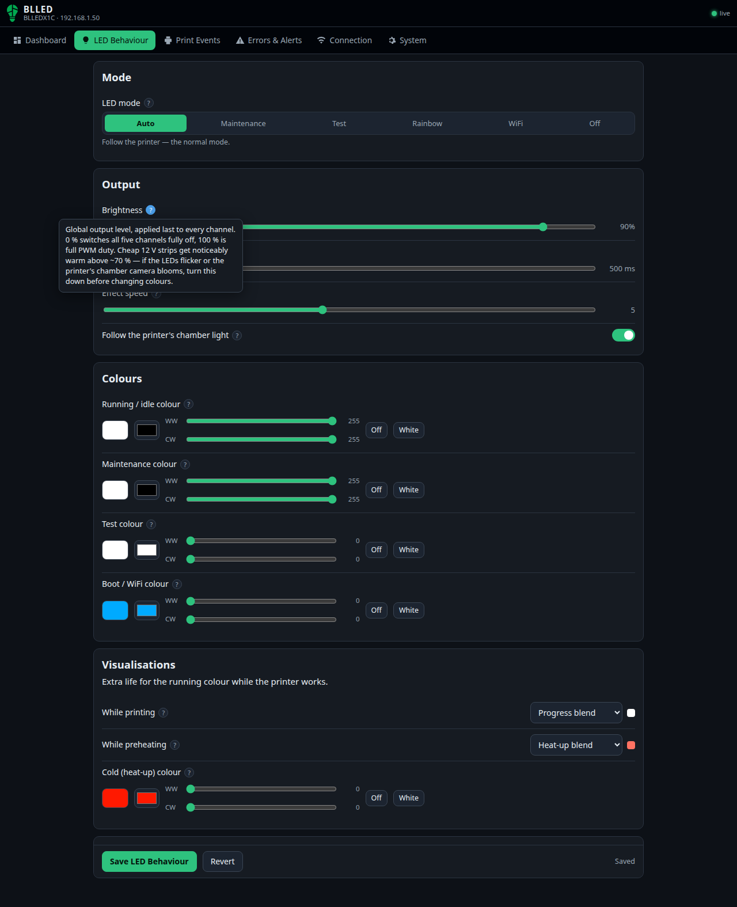

# LED Behaviour
{: .no_toc }

Everything about the strip itself: what mode it runs in, how bright and how fast it moves, the four
base colours, and the two optional visualisations.

  
On this page

  {: .text-delta }
- TOC
{:toc}

---

## Mode

**LED mode** picks what the strip does at the highest level.

| Mode | What it does |
|---|---|
| **Auto** | Follows the printer. This is the whole point of BLLED. |
| **Maintenance** | Holds the maintenance colour, whatever the printer is doing — for working on the machine. |
| **Test** | Holds the test colour, for checking your wiring. |
| **Rainbow** | A decorative colour cycle that ignores the printer. It looks good in timelapses. |
| **WiFi** | Colours the strip by signal strength, so you can find a good spot for the controller. |
| **Off** | Kills the output without unplugging anything. |

The dashboard has the same switch, so you can flip to Maintenance and back without leaving the
live view.

## Output

### Brightness

The global output level, applied last to every channel. **0 %** switches all five channels fully
off; **100 %** is full PWM duty.

Cheap 12 V strips get noticeably warm above about **70 %**. If the LEDs flicker, or the printer's
chamber camera blooms, turn this down before you start changing colours.

Default: **20 %**, deliberately low so an undersized power supply does not sag on first boot.

### Fade time

How long the strip takes to cross-fade when the colour changes, in milliseconds.

**500 ms** (the default) feels smooth and hides the constant micro-changes during a print.
**0** makes every state change a hard cut, which is what you want if you are filming the LEDs or
debugging the state machine.

### Effect speed

Speed of the breathe, blink and rainbow animations, from **1** (slow) to **10** (fast). At the
default of **5**, a breathe cycle takes about 3 seconds and a blink about 0.75 s.

It only affects animated effects. With everything set to Solid it does nothing.

### Follow the printer's chamber light

Mirrors the printer's own chamber light. Switch the light off in the Bambu app or on the printer's
screen and BLLED goes dark with it; switch it on and BLLED comes back.

Leave it **on** if you want one light switch for the whole printer. Turn it **off** if BLLED is
your only chamber light and should stay on regardless. Default: **on**.

{: .note }
> A dark strip whose reason line says *"Chamber light off"* is this setting doing its job.

## Colours

Each colour has separate **RGB** and **warm/cold white** channels, so you can mix a tint into white
light or run pure colour with the whites off.

| Setting | What it is | Default |
|---|---|---|
| **Running / idle colour** | The everyday colour: printing, preheating, homing and sitting idle. This is what you look at 95 % of the time, so set it first. | Warm + cold white at full |
| **Maintenance colour** | Used while the mode is Maintenance. Both whites at maximum gives the brightest, most neutral working light — what you want when you are clearing a clog or re-seating a hotend. | Warm + cold white at full |
| **Test colour** | Used while the mode is Test. A saturated colour makes it obvious which channels are actually wired: if you see white instead of blue, your warm/cold white lines are swapped in. | `#3F3CFB` |
| **Boot / WiFi colour** | Shown during boot while the controller joins WiFi, and on the setup access point. If the strip stays this colour, BLLED never finished connecting — check the [Connection](connection.md) tab. | Orange `#FFA500` |

Adding RGB to the running colour only if you want a tint is usually the right instinct — the white
channels are far brighter than the coloured ones on most strips.

## Visualisations

Extra life for the running colour while the printer works. Both are optional and default to
**Solid**, which is the classic BLLED behaviour.

### While printing

| Option | What it does |
|---|---|
| **Solid** | Never changes. |
| **Progress blend** | Blends the running colour towards the finish colour as the print advances, so a glance at the strip tells you roughly how far along it is. |
| **Breathe** | Pulses gently, so you can see from a distance that the machine is still working. |

### While preheating

| Option | What it does |
|---|---|
| **Solid** | The plain running colour. |
| **Heat-up blend** | The strip is unmistakably orange while heating and white once nozzle *and* bed are ready. |

**How the heat-up blend actually looks.** It starts with the **cold colour on its own** — the white
channels off — at a reduced brightness, and that brightness ramps up as the heaters warm. Only over
the **last ~15 % before target** does it fade into the running colour. The result reads as "orange,
getting brighter, then turning white", rather than washing out to white immediately (which is what
a plain linear blend does on a strip with white channels).

It is keyed on the **slowest heater**: whichever of the nozzle and the bed is furthest from its
target drives the blend, so the strip only turns white when both are actually there.

### Cold (heat-up) colour

The cold end of that blend — what the strip shows when the heaters have just switched on. Default
orange `#FF6A00`. Pick something clearly different from your running colour so the change is
obvious across the room.

This field only appears when *While preheating* is set to **Heat-up blend**.

## Every setting has a tooltip

The **?** next to a label opens the same explanation you have just read, right where you need it.
The full collection is in the [Settings reference](../manual.md).
